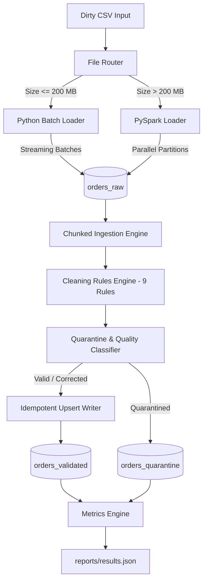

# معمارية خط البيانات الهجين (Architecture Design)

## 🏗️ نظرة عامة على المعمارية

تم بناء هذا المشروع وفق نمط **ELT (Extract, Load, Transform)** لمعالجة تدفقات البيانات غير النظيفة، بحيث يتم أولاً تحميل البيانات بنسختها الأصلية الكاملة إلى طبقة التخزين الخام (`orders_raw`)، ثم تُجرى عليها عمليات التحويل والتنظيف والتصنيف وتُنقل إما إلى طبقة البيانات الصالحة (`orders_validated`) أو طبقة العزل (`orders_quarantine`).

---

## 🎯 المبادئ المعمارية المطبقة (Design Principles)

1. **Memory-Safe Streaming**:
   - لا يتم تحميل أي ملف بالكامل داخل الذاكرة كـ DataFrame أو List.
   - يتم تدفق البيانات وقراءتها من MongoDB عبر مؤشرات (`Cursors`) ومعالجتها في دفعات بحجم `5000` سجل ثابتة في الذاكرة $O(1)$.

2. **Decoupled Architecture & Single Responsibility**:
   - كل ملف وكل صنف مسؤول عن وظيفة وحيدة (Routing، Ingestion، Cleaning، Upserting، Metrics).

3. **Open / Closed Principle (OCP)**:
   - إضافة أي قاعدة تنظيف جديدة تتم بإنشاء صنف يرث من `CleaningRule` وإضافتها في الـ `RuleRegistry` دون تعديل كود المعالجة الرئيسي.

4. **Idempotency & Version Handling**:
   - الفهرس الفريد على `order_id` يمنع تكرار البيانات.
   - التحميل التزايدي يفحص `order_date` لضمان عدم الكتابة فوق التحديثات الأحدث.

5. **Auditing & Traceability**:
   - السجلات المصححة تحتفظ بمصفوفة `corrections` توضح الحقول المعدلة والقيم القديمة والجديدة ورمز القاعدة.
   - السجلات المعزولة تحتفظ بنسخة من السجل الخام ومصفوفة `error_codes` و `error_details`.
