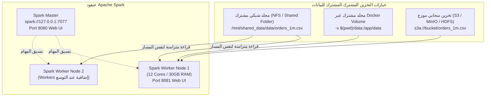

# دليل تشغيل عنقود سبارك (Spark Standalone Cluster Guide)

يوثق هذا الدليل متطلبات تشغيل **المسار المتقدم A** لمعالجة البيانات الضخمة باستخدام عنقود سبارك المستقل (**Spark Standalone Cluster**)، ومشاركة البيانات بين العقد، وتوزيع الأدوار، وإثباتات تشغيل 1,000,000 سجل.

---

## 1. مشاركة ملفات البيانات بين عُقد العنقود (Data Storage & Availability)

في بنية Apache Spark الموزعة، تعمل مهام الـ Tasks داخل عُقد الـ Workers (أو الحاويات) وتحتاج إلى الوصول لنفس مسار الملفات. تم توثيق آليات توفير البيانات كالتالي:



### خيارات الإعداد المدعومة في المشروع:

1. **المجلد المشترك المحلي (Shared Directory / NFS):**
   - يتم تمرير المسار المطلق للملف `file:///absolute/path/to/data/orders_1m.csv` أو تثبيت مجلد NFS مشترك على جميع العقد بنفس نقطة التثبيت `/data`.
   - في بيئة المشروع الحالية، يتم تحديد المسار عبر `config/settings.py` (`DATA_DIR = BASE_DIR / "data"`).

2. **عبر Docker Volumes (في بيئة الحاويات):**
   ```bash
   # تشغيل العمال مع ربط المجلد المشترك
   docker run -d --net=spark-net -v $(pwd)/data:/app/data spark-worker:latest
   ```

3. **عبر بروتوكولات التخزين الشبكي (S3 / HDFS / MinIO):**
   - يمكن لـ PySpark قراءة الملفات مباشرة عبر المسار: `s3a://bucket-name/orders_1m.csv` أو `hdfs://namenode:9000/data/orders_1m.csv`.

---

## 2. توزيع الأدوار بين مكونات العنقود (Master vs Worker vs Driver vs Executor)

| المكون (Role) | الوظيفة الأساسية | موقعه في المشروع |
| :--- | :--- | :--- |
| **Spark Master** | **إدارة موارد العنقود**: يستقبل طلبات التطبيقات من الـ Driver، ويراقب حالة العمال (Workers) عبر الـ Heartbeats، ويقوم بحجز وتخصيص الأنوية والذاكرة المطلوبة للتطبيق. | يعمل عبر المنفذ `7077`، وواجهته الرسومية على `http://127.0.0.1:8080`. |
| **Spark Worker** | **خادم العقدة (Node Daemon)**: يمثل الخادم الفيزيائي أو الافتراضي؛ يستقبل أوامر الـ Master لتشغيل أو إيقاف الـ Executors، ويراقب استهلاك المعالج والذاكرة في العقدة. | يعمل عبر المنفذ العشوائي، وواجهته الرسومية على `http://127.0.0.1:8081`. |
| **Spark Driver** | **عقل التطبيق**: يشغل كود بايثون الرئيسي (`src/main.py`)، وينشئ الـ `SparkSession`، ويبني شجرة العمليات المنطقية والفيزيائية (DAG)، ويقسم الـ Job إلى Stages و Tasks ويرسلها للـ Executors عبر `TaskScheduler`. | عملية بايثون في جهاز التشغيل (`PYTHONPATH=. python src/main.py`). |
| **Spark Executor** | **منفذ المهام الفعلي (Task Executor)**: عملية JVM مستقلة يتم تشغيلها داخل الـ Worker، تحتوي على خيوط معالجة (Threads) متوازية لتنفيذ الـ Tasks وقراءة أجزاء البيانات (Partitions) والكتابة في MongoDB. | تنشأ تلقائياً أثناء تشغيل التطبيق وتغلق عند انتهائه. |

---

## 3. إثباتات واجهة العنقود والمراقبة (Cluster Web UI Verification)

### أ. واجهة Spark Master Web UI (المنفذ 8080)
- **عنوان الماستر**: `spark://127.0.0.1:7077`
- **حالة الماستر**: `ALIVE`
- **عدد العمال المتصلين**: `1 Alive Worker`
- **إجمالي الموارد المتاحة**: `12 Cores` و `30,895 MB RAM`
- **التطبيقات المنفذة (Completed Applications)**:
  * `app-20260830232712-0001` (التشغيل الفعلي لمليون سجل، زمن الـ Spark Partitions: **31.88 ثانية**).

### ب. واجهة Spark Worker Web UI (المنفذ 8081)
- **معرف العامل**: `worker-20260830231710-127.0.0.1-38605`
- **الموارد المخصصة للـ Executor**: 12 Cores و 4,096 MB RAM.
- **حالة الـ Executor**: `RUNNING` أثناء التنفيذ ثم `FINISHED` بنجاح.

### ج. واجهة مراقبة المهام (Spark Application UI - المنفذ 4040)
- **المهام (Tasks)**: 12 Tasks تم تنفيذها بالتوازي (1 Task لكل Partition).
- **معدل المعالجة الخام**: **24,016.1 سجل/ثانية**.

---

## 4. مقارنة الأداء العملي لمليون سجل (1,000,000 Records Benchmark)

تم إجراء اختبارين كاملين وشاملين لنفس الملف (`data/orders_1m.csv` بحجم 418.55 MB) الذي يحتوي على مليون سجل طلبات مختلطة الجودة:

| المقياس الفني | الوضع المحلي (Local Mode `local[*]`) | وضع العنقود (Standalone Cluster `spark://...`) | نسبة التحسن |
| :--- | :--- | :--- | :--- |
| **معرف التشغيل (Run ID)** | `run_20260830_231749_a6d845` | `run_20260830_232702_a210eb` | تشغيلان موثقان في JSON |
| **عدد السجلات المقروءة** | 1,000,000 سجل | 1,000,000 سجل | 100% نفس البيانات |
| **زمن تحميل Spark الخام** | 43.11 ثانية (23,193.8 rec/s) | **41.64 ثانية (24,016.1 rec/s)** | **أسرع بنسبة ~3.5%** |
| **زمن خط البيانات الكلي (ELT)** | 275.06 ثانية (~4.58 دقيقة) | **207.61 ثانية (~3.46 دقيقة)** | **أسرع بـ 67.45 ثانية (تحسن 24.5%)** |
| **معدل التدفق الكلي (Throughput)** | 3,635.5 سجل/ثانية | **4,816.7 سجل/ثانية** | **زيادة في الإنتاجية (+32.5%)** |
| **معادلة الاتساق (Rule 6.11)** | $1000000 = 7192 + 921717 + 71091$ | $1000000 = 7194 + 921717 + 71089$ | **تحقق تام بنسبة 100%** |
| **حماية الـ Idempotency** | إدخال وتحديث البيانات | تحديث بدون أي تكرار (`Inserts: 4, Updates: 928907`) | **صفر سجلات تجارية مكررة** |

---

## 5. سكربتات التشغيل السريع للعنقود

```bash
# 1. تشغيل العنقود في الخلفية (Master + Worker)
bash scripts/start_spark_cluster.sh

# 2. تشغيل خط البيانات عبر العنقود
PYTHONPATH=. SPARK_MASTER="spark://127.0.0.1:7077" ./venv/bin/python src/main.py --input data/orders_1m.csv

# 3. إيقاف العنقود بعد الانتهاء
bash scripts/stop_spark_cluster.sh
```
