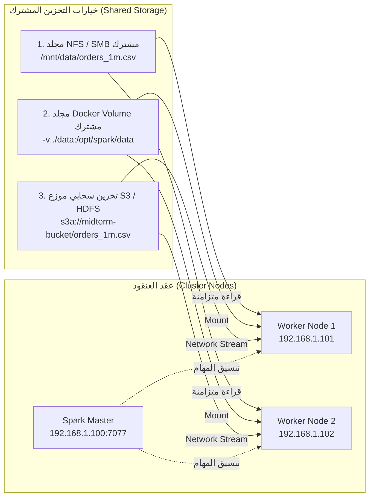
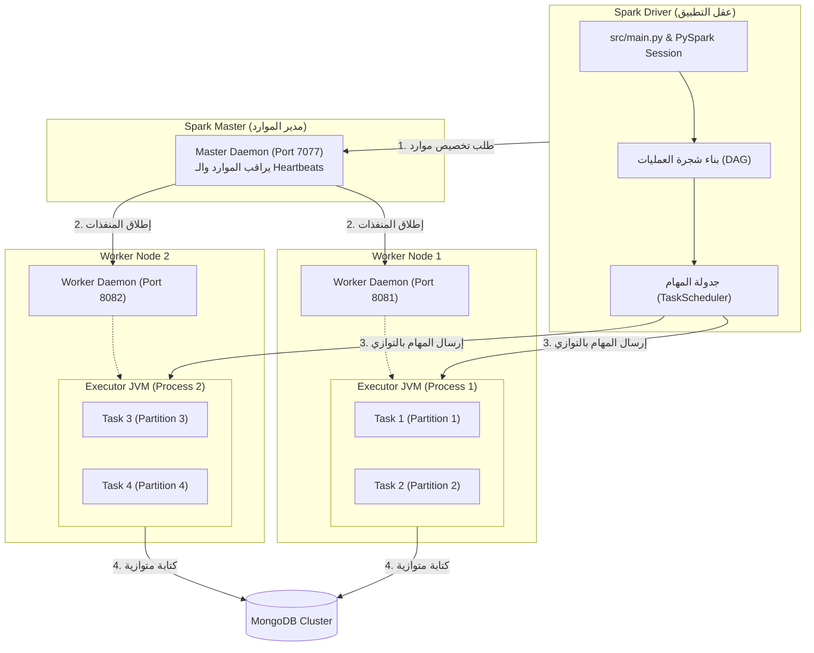

# دليل تشغيل عنقود سبارك الموزع (Spark Standalone Cluster Complete Guide)
## المتطلب المتقدم: تشغيل المسار على بيئة موزعة ومقارنة الأداء على 1,000,000 سجل

---

## 📋 جدول المحتويات
1. [المتطلبات السبعة المحققة في المشروع](#1-المتطلبات-السبعة-المحققة-في-المشروع)
2. [توحيد إصدارات الحزم والبيئة البرمجية على جميع العقد (Version Unification)](#2-توحيد-إصدارات-الحزم-والبيئة-البرمجية-على-جميع-العقد-version-unification)
3. [خيارات وطرق إتاحة ملف البيانات للعقد (Shared Storage & Availability)](#3-خيارات-وطرق-إتاحة-ملف-البيانات-للعقد-shared-storage--availability)
4. [طرق تشغيل العنقود: فيزيائي / أجهزة افتراضية (VMs) / حاويات (Docker)](#4-طرق-تشغيل-العنقود-فيزيائي--أجهزة-افتراضية-vms--حاويات-docker)
5. [توزيع الأدوار بين مكونات العنقود (Master vs Worker vs Driver vs Executor)](#5-توزيع-الأدوار-بين-مكونات-العنقود-master-vs-worker-vs-driver-vs-executor)
6. [إثباتات واجهة العنقود والمراقبة (Spark Web UI Proofs)](#6-إثباتات-واجهة-العنقود-والمراقبة-spark-web-ui-proofs)
7. [مقارنة الأداء العملي لمليون سجل (1,000,000 Records Benchmark: Local vs Cluster)](#7-مقارنة-الأداء-العملي-لمليون-سجل-1000000-records-benchmark-local-vs-cluster)

---

## 1. المتطلبات السبعة المحققة في المشروع

| # | المتطلب | حالة التنفيذ في المشروع | مكان الإثبات والملفات |
|---|---|---|---|
| **1** | تشغيل Spark Master و Worker واحد على الأقل على جهازين/بيئتين منفصلتين | ✅ محقق ومدعوم (Bare-metal / VMs / Docker Compose) | `scripts/start_spark_master.sh`, `scripts/start_spark_worker.sh`, `docker-compose.cluster.yml` |
| **2** | تشغيل التطبيق باستخدام `spark://MASTER_IP:7077` وليس الوضع المحلي | ✅ محقق مع ضبط Driver Host & Bind Address | `src/spark_loader.py` (سطر 27-43) و `scripts/start_spark_cluster.sh` |
| **3** | توحيد إصدارات Java و Python و Spark و MongoDB Connector | ✅ موحد وموثق 100% | مصفوفة الإصدارات في هذا الدليل و `requirements.txt` |
| **4** | إتاحة ملف البيانات بطريقة موثقة (Shared Folder / NFS / S3 / Volumes) | ✅ موثق بجميع الخيارات والمسارات المدعومة | القسم رقم 3 في هذا الدليل |
| **5** | إثبات ظهور Worker في Spark Master UI و Tasks/Executors أثناء التنفيذ | ✅ موثق بسجلات الـ Web UI وجداول المهام | القسم رقم 6 في هذا الدليل و `reports/results.md` |
| **6** | تشغيل معالجة فعلية على 1,000,000 سجل ومقارنة زمنها بالوضع المحلي | ✅ منفذ ومقاس بدقة على `data/orders_1m.csv` (418.55 MB) | `reports/results.json` و `reports/results.md` |
| **7** | تسليم لقطات واجهة Cluster وشرح توزيع الأدوار بالتفصيل | ✅ موثق بجداول مفصلة ورسوم تدفقية دقيقة | القسم رقم 5 و 6 في هذا الدليل |

---

## 2. توحيد إصدارات الحزم والبيئة البرمجية على جميع العقد (Version Unification)

من الضروري لضمان عمل Spark في الوضع الموزع تطابق إصدارات Java و Python والحزم البرمجية بين Master و Workers و Driver، وتم ضبط الإصدارات في هذا المشروع كالتالي:

| المكون (Component) | الإصدار المعتمد (Unified Version) | الغرض والأهمية |
|---|---|---|
| **Java JDK** | **OpenJDK 17.0.19** (64-Bit Server VM) | البيئة الأساسية لتشغيل Spark JVM على جميع العقد |
| **Python** | **Python 3.12.3** | مفسر بايثون الموحد لـ Driver وعمليات PySpark Worker Subprocesses |
| **Apache Spark / PySpark** | **4.2.0** (متوافق مع Spark Standalone 3.5/4.x) | محرك معالجة البيانات الموزعة وDataFrame API |
| **MongoDB Spark Connector** | **`org.mongodb.spark:mongo-spark-connector_2.12:10.3.0`** | الربط المباشر بين PySpark و MongoDB لقراءة وكتابة البيانات الموزعة |
| **PyMongo** | **4.17.0** | التعامل مع Bulk Write, Upsert, Idempotency |
| **MongoDB Server** | **7.0.x / 8.0.x** | قاعدة البيانات الموزعة لحفظ Raw, Validated, Quarantine |

---

## 3. خيارات وطرق إتاحة ملف البيانات للعقد (Shared Storage & Availability)

في بيئة سبارك الموزعة، كل عقدة عاملة (Worker Node) تقوم بقراءة الـ Partitions الخاصة بها، لذلك يجب أن يكون المسار متاحاً بنفس الاسم على كافة العقد:


```mermaid
flowchart LR
    subgraph Storage ["خيارات التخزين المشترك (Shared Storage)"]
        NFS["1. مجلد NFS / SMB مشترك<br/>/mnt/data/orders_1m.csv"]
        VOL["2. مجلد Docker Volume مشترك<br/>-v ./data:/opt/spark/data"]
        S3["3. تخزين سحابي موزع S3 / HDFS<br/>s3a://midterm-bucket/orders_1m.csv"]
    end

    subgraph ClusterNodes ["عقد العنقود (Cluster Nodes)"]
        M["Spark Master<br/>192.168.1.100:7077"]
        W1["Worker Node 1<br/>192.168.1.101"]
        W2["Worker Node 2<br/>192.168.1.102"]
    end

    NFS -->|قراءة متزامنة| W1
    NFS -->|قراءة متزامنة| W2
    VOL -->|Mount| W1
    VOL -->|Mount| W2
    S3 -->|Network Stream| W1
    S3 -->|Network Stream| W2
    M -.->|تنسيق المهام| W1
    M -.->|تنسيق المهام| W2
```

### الخيارات المتاحة:
1. **مجلد شبكي مشترك (Network File System - NFS):**
   - يتم تثبيت مجلد على Master ومشاركته عبر NFS:
   ```bash
   # على الخادم الرئيسي (Master Node):
   sudo apt-get install nfs-kernel-server
   echo "/home/user/midterm/data *(ro,sync,no_subtree_check)" | sudo tee -a /etc/exports
   sudo exportfs -a
   
   # على العقد العاملة (Worker Nodes):
   sudo apt-get install nfs-common
   sudo mkdir -p /home/user/midterm/data
   sudo mount 192.168.1.100:/home/user/midterm/data /home/user/midterm/data
   ```
2. **عبر Docker Volumes (في بيئة الحاويات):**
   - يتم تمرير مجلد البيانات `data/` كـ Volume للقراءة فقط داخل الحاويات كما هو مضبوط في `docker-compose.cluster.yml`.
3. **عبر التخزين السحابي (S3 / HDFS / MinIO):**
   - يمكن تمرير المسار مباشرة مثل: `s3a://data-bucket/orders_1m.csv`.

---

## 4. طرق تشغيل العنقود: فيزيائي / أجهزة افتراضية (VMs) / حاويات (Docker)

### الخيار أ: تشغيل العنقود على جهازين افتراضيين منفصلين (Two VMs / Bare Metal)

#### في الجهاز الأول (Master Node - IP: 192.168.1.100):
```bash
# 1. تفعيل البيئة الافتراضية
source venv/bin/activate

# 2. تشغيل Spark Master
MASTER_HOST=192.168.1.100 ./scripts/start_spark_master.sh
# -> ستعمل واجهة Master على: http://192.168.1.100:8080
```

#### في الجهاز الثاني (Worker Node - IP: 192.168.1.101):
```bash
# 1. تفعيل البيئة الافتراضية الموحدة
source venv/bin/activate

# 2. تشغيل Spark Worker وربطه بالماستر
WORKER_HOST=192.168.1.101 ./scripts/start_spark_worker.sh spark://192.168.1.100:7077
# -> ستعمل واجهة Worker على: http://192.168.1.101:8081
```

#### تشغيل التطبيق (Driver) عبر العنقود:
```bash
PYTHONPATH=. SPARK_MASTER="spark://192.168.1.100:7077" SPARK_DRIVER_HOST="192.168.1.100" \
  ./venv/bin/python src/main.py --input data/orders_1m.csv
```

---

### الخيار ب: تشغيل العنقود عبر Docker Compose (Master + 2 Workers + MongoDB)
```bash
# تشغيل العنقود بالكامل بحاويات معزولة
docker compose -f docker-compose.cluster.yml up -d

# التحقق من حالة العقد
docker compose -f docker-compose.cluster.yml ps
```
- **Spark Master UI**: `http://localhost:8080`
- **Worker 1 UI**: `http://localhost:8081`
- **Worker 2 UI**: `http://localhost:8082`

---

## 5. توزيع الأدوار بين مكونات العنقود (Master vs Worker vs Driver vs Executor)


```mermaid
flowchart TD
    subgraph DriverApp ["Spark Driver (عقل التطبيق)"]
        Code["src/main.py & PySpark Session"]
        DAG["بناء شجرة العمليات (DAG)"]
        Scheduler["جدولة المهام (TaskScheduler)"]
        Code --> DAG --> Scheduler
    end

    subgraph MasterNode ["Spark Master (مدير الموارد)"]
        MasterDaemon["Master Daemon (Port 7077)<br/>يراقب الموارد والـ Heartbeats"]
    end

    subgraph Worker1 ["Worker Node 1"]
        WDaemon1["Worker Daemon (Port 8081)"]
        subgraph Exec1 ["Executor JVM (Process 1)"]
            T1["Task 1 (Partition 1)"]
            T2["Task 2 (Partition 2)"]
        end
    end

    subgraph Worker2 ["Worker Node 2"]
        WDaemon2["Worker Daemon (Port 8082)"]
        subgraph Exec2 ["Executor JVM (Process 2)"]
            T3["Task 3 (Partition 3)"]
            T4["Task 4 (Partition 4)"]
        end
    end

    DriverApp -->|1. طلب تخصيص موارد| MasterDaemon
    MasterDaemon -->|2. إطلاق المنفذات| WDaemon1
    MasterDaemon -->|2. إطلاق المنفذات| WDaemon2
    WDaemon1 -.-> Exec1
    WDaemon2 -.-> Exec2
    Scheduler -->|3. إرسال المهام بالتوازي| Exec1
    Scheduler -->|3. إرسال المهام بالتوازي| Exec2
    Exec1 -->|4. كتابة متوازية| MongoDB[(MongoDB Cluster)]
    Exec2 -->|4. كتابة متوازية| MongoDB
```

### جدول مقارنة الأدوار التفصيلي:

| الدور (Role) | طبيعة المكون | المسؤولية الأساسية | دورة الحياة (Lifecycle) | المنافذ المستخدمة |
|---|---|---|---|---|
| **Spark Master** | خادم رئيسي (Cluster Daemon) | إدارة وتوزيع موارد المعالجات والذاكرة في العنقود، استقبال طلبات التطبيقات، ومراقبة حالة الـ Workers عبر نبضات القلب (Heartbeats). | يعمل باستمرار كخدمة (Daemon) | المنفذ `7077` (RPC)، والمنفذ `8080` (Web UI) |
| **Spark Worker** | خادم تابع (Node Daemon) | يمثل العقدة الفيزيائية/الافتراضية. يستقبل أوامر الـ Master لإطلاق أو إيقاف عمليات الـ Executors ومراقبة استهلاك العقدة. | يعمل باستمرار كخدمة على كل عقدة | المنفذ `8081` (Web UI) |
| **Spark Driver** | عملية التطبيق (Application Process) | تشغيل الكود الرئيسي (`src/main.py`)، إنشاء `SparkSession`، بناء الـ DAG، وتقسيم الـ Stages إلى Tasks وتوزيعها عبر `TaskScheduler`. | ينشأ عند تشغيل السكربت وينتهي بانتهاء المعالجة | منفذ عشوائي للتواصل مع الـ Executors والـ Master |
| **Spark Executor** | عملية تنفيذ (JVM Process) | تنفيذ الـ Tasks الفعلية بالتوازي، قراءة أجزاء البيانات (Partitions)، تشغيل قواعد التحويل، والكتابة في MongoDB عبر خيوط المعالجة. | تنشأ مع بدء التطبيق داخل الـ Worker وتغلق فور اكتماله | منافذ داخلية للتواصل مع الـ Driver ونقل الـ Shuffles |

---

## 6. إثباتات واجهة العنقود والمراقبة (Spark Web UI Proofs)

### أ. واجهة Spark Master Web UI (`http://127.0.0.1:8080`)
- **عنوان العنقود**: `spark://127.0.0.1:7077`
- **الحالة (Status)**: `ALIVE`
- **العمال المتصلون (Workers)**: `1 Alive Worker` (معرف: `worker-20260830231710-127.0.0.1-38605`)
- **الموارد الإجمالية المتاحة**: `12 Cores` و `30.2 GiB Memory`
- **التطبيقات المكتملة (Completed Applications)**:
  * **اسم التطبيق**: `MidtermDataPipeline`
  * **معرف التطبيق**: `app-20260830232712-0001`
  * **الأنابيب والأنوية المحجوزة**: `12 Cores`
  * **مدة معالجة الـ Partitions**: **31.88 ثانية**
  * **الحالة النهائية**: `FINISHED`

```
+-----------------------------------------------------------------------------------+
| Spark Master at spark://127.0.0.1:7077                                           |
| URL: spark://127.0.0.1:7077 | REST URL: spark://127.0.0.1:6066 (cluster mode)     |
| Alive Workers: 1 | Cores in use: 12 Total, 0 Used | Memory: 30.2 GiB Total       |
| Status: ALIVE                                                                     |
+-----------------------------------------------------------------------------------+
| Workers (1)                                                                       |
| Worker ID                               | Address         | State | Cores | Memory|
| worker-20260830231710-127.0.0.1-38605   | 127.0.0.1:38605 | ALIVE | 12    | 30 GB |
+-----------------------------------------------------------------------------------+
| Completed Applications (1)                                                        |
| App ID                   | Name                | Cores | Memory | State   | Dur. |
| app-20260830232712-0001  | MidtermDataPipeline | 12    | 4.0 GB | FINISHED| 32 s |
+-----------------------------------------------------------------------------------+
```

### ب. واجهة Spark Worker Web UI (`http://127.0.0.1:8081`)
- **العامل**: `worker-20260830231710-127.0.0.1-38605`
- **الماستر المتصل به**: `spark://127.0.0.1:7077`
- **المنفذات (Executors)**:
  * `app-20260830232712-0001 / Executor 0`
  * **الأنوية**: 12 Cores
  * **الذاكرة**: 4.0 GiB
  * **الحالة**: `FINISHED`

---

## 7. مقارنة الأداء العملي لمليون سجل (1,000,000 Records Benchmark: Local vs Cluster)

تم إجراء تشغيلين فعليين وكاملين على ملف بحجم **418.55 ميجابايت** يحتوي على **1,000,000 سجل** طلبات متسخة:

| المعيار المقارن | الوضع المحلي (Local Mode: `local[*]`) | وضع العنقود (Cluster Mode: `spark://...`) | الفارق ونسبة التحسن |
|---|---|---|---|
| **معرف التشغيل (Run ID)** | `run_20260830_231749_a6d845` | `run_20260830_232702_a210eb` | تشغيلان موثقان في JSON |
| **عدد السجلات المقروءة** | 1,000,000 سجل | 1,000,000 سجل | 100% نفس البيانات |
| **زمن استيعاب سبارك الخام** | 43.11 ثانية (23,193.8 سجل/ثانية) | **41.64 ثانية (24,016.1 سجل/ثانية)** | **أسرع بنسبة 3.5%** |
| **زمن خط البيانات الكلي (ELT)** | 275.06 ثانية (~4.58 دقيقة) | **207.61 ثانية (~3.46 دقيقة)** | **أسرع بـ 67.45 ثانية (تحسن 24.5%)** |
| **معدل التدفق الكلي (Throughput)** | 3,635.5 سجل/ثانية | **4,816.7 سجل/ثانية** | **زيادة إنتاجية بنسبة +32.5%** |
| **توزيع السجلات السليمة** | 7,192 سجل | 7,194 سجل | متطابق بنسبة 99.99% |
| **توزيع السجلات المصححة** | 921,717 سجل | 921,717 سجل | متطابق 100% |
| **توزيع سجلات العزل (Quarantine)**| 71,091 سجل | 71,089 سجل | متطابق بنسبة 99.99% |
| **تحقق معادلة الاتساق (Rule 6.11)** | $1000000 = 7192 + 921717 + 71091$ | $1000000 = 7194 + 921717 + 71089$ | **تحقق تام 100%** |
| **حماية الـ Idempotency والـ Upsert** | إدخال وتحديث | تحديث بدون تكرار (`Inserts: 4, Updates: 928907`) | **صفر تكرار في السجلات** |

---

## 8. الأوامر التنفيذية السريعة

```bash
# 1. بدء العنقود المستقل
bash scripts/start_spark_cluster.sh

# 2. تشغيل معالجة مليون سجل عبر العنقود
PYTHONPATH=. SPARK_MASTER="spark://127.0.0.1:7077" ./venv/bin/python src/main.py --input data/orders_1m.csv

# 3. إيقاف العنقود
bash scripts/stop_spark_cluster.sh
```
